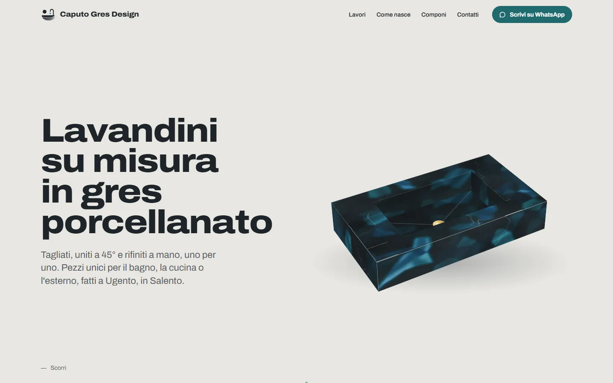
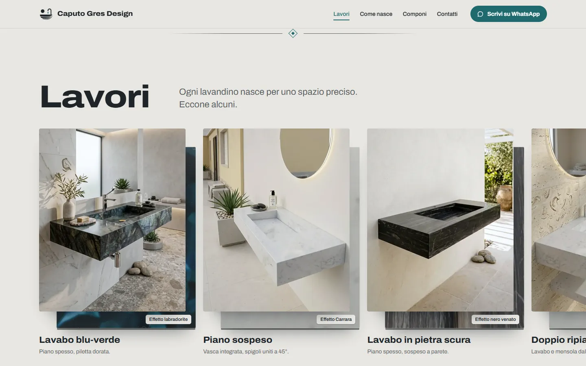
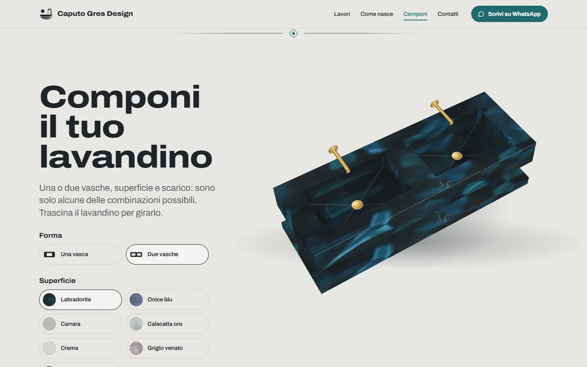

# 🛁 Caputo Gres Design

  

🌐 **Live:** [caputogresdesign.pages.dev](https://caputogresdesign.pages.dev/)

> **Lavandini su misura in gres porcellanato, tagliati, uniti a 45° e rifiniti a mano a Ugento, nel Salento.**

- 🪨 Il sito vetrina di un laboratorio artigianale: i lavori fatti, come nasce un lavandino e un lavandino 3D da comporre
- 💬 Nessun e-commerce: chi visita sceglie un'idea e scrive su WhatsApp con un messaggio già pronto

## 📸 Schermate

<p align="center">
  
  
  
</p>

<p align="center"><sub>Apertura · Lavori · Componi</sub></p>

---

## ✨ Funzionalità principali

- 🧱 Apertura animata: una lastra di gres si taglia, si piega e diventa un lavandino mentre scorri
- 🖼️ Lavori in una galleria a scorrimento orizzontale, con il campione della lastra dietro ogni foto
- 🔍 Ogni lavoro si apre in grande, con «Chiedine uno simile» che prepara già il messaggio
- 🛠️ «Come nasce»: i cinque passi della lavorazione, dalle misure alla posa
- 🧩 «Componi il tuo lavandino»: lavandino 3D da girare col mouse o col dito, con forma, superficie, scarico, rubinetto e mensola
- 💬 Contatto solo su WhatsApp, con messaggio modificabile prima dell'invio
- 📱 Pensato per telefono e computer, con menu a pannello sugli schermi piccoli
- ♿ Navigabile da tastiera e rispettoso di «Riduci movimento»: con l'impostazione attiva le animazioni si spengono

---

## 🛠️ Tecnologie

- **Vite** con JavaScript vanilla, senza framework
- **GSAP** con ScrollTrigger e SplitText per le animazioni
- **Lenis** per lo scorrimento fluido
- **CSS 3D** per il lavandino, senza librerie 3D né WebGL
- **Archivo Variable** ospitato in locale tramite Fontsource
- **Cloudflare Pages** per la pubblicazione

---

## ⚡ Avviare il progetto

Serve Node.js **20.19+** o **22.12+**.

### 1. Clona la repository
```bash
git clone https://github.com/lorenzocaputodev/caputogresdesign.git
cd caputogresdesign
```

### 2. Installa le dipendenze
```bash
npm install
```

### 3. Avvia il sito
```bash
npm run dev
```

### 4. Build di produzione
```bash
npm run build
npm run preview
```

Per pubblicare su Cloudflare Pages: `npm run deploy` (serve l'accesso con `npx wrangler login`).

La build genera in `dist/` anche la galleria in HTML, i dati strutturati per i motori di ricerca, `robots.txt`, `sitemap.xml` e gli header di sicurezza per Cloudflare.

---

## 📂 Struttura essenziale

- `index.html` → markup e testi della pagina
- `src/main.js` → avvio dei moduli
- `src/hero.js`, `src/galleria.js`, `src/componi.js`, … → un modulo per ogni sezione
- `src/sink.js` → il lavandino 3D in CSS
- `src/style.css` → token di design e stili, nell'ordine delle sezioni
- `src/config.js` → indirizzo del sito, contatti e social
- `src/lavori.js` → i lavori della galleria
- `public/` → foto dei lavori, texture delle superfici, icone e pagina 404
- `vite.config.js` → plugin che generano galleria, SEO e header

---

## 🔐 Privacy

- Nessun cookie e nessun sistema di tracciamento
- Nessun backend: il contatto passa direttamente da WhatsApp
- Font e risorse serviti dallo stesso sito, senza servizi esterni

---

## ©️ Diritti

© Caputo Gres Design. Tutti i diritti riservati: codice, testi, foto e marchio non sono riutilizzabili senza permesso.

---

## 👤 Autore

**Lorenzo Caputo**  
GitHub: [lorenzocaputodev](https://github.com/lorenzocaputodev)  
Portfolio: [lorenzocaputo.is-a.dev](https://lorenzocaputo.is-a.dev/)
